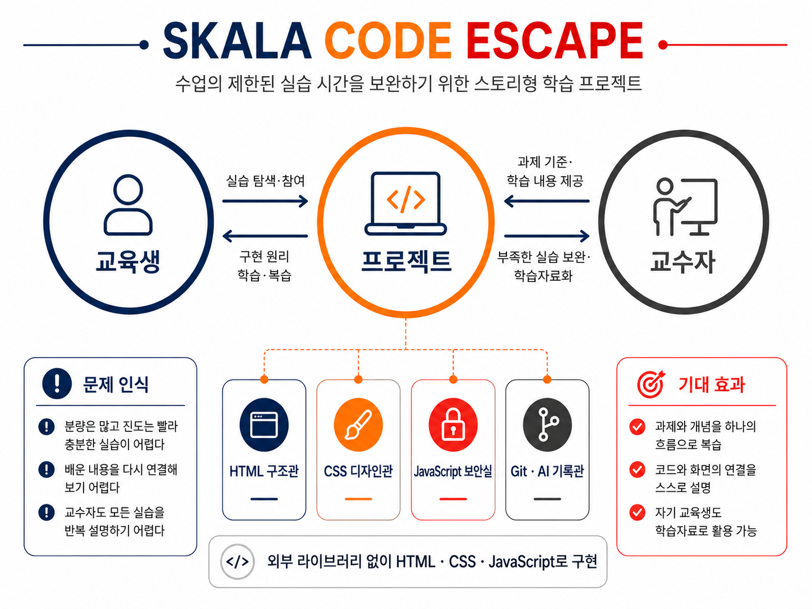

# skala-front
SKALA 프론트엔드 프로젝트; SKALA CODE ESCAPE

# SKALA CODE ESCAPE

<p align="center">
  
</p>

<p align="center">
  <strong>수업의 제한된 실습 시간을 보완하는 스토리형 프론트엔드 학습 프로젝트</strong>
</p>

---

## 프로젝트 소개

**SKALA CODE ESCAPE**는 HTML·CSS·JavaScript·Git 과제를 단순히 나열하지 않고, 하나의 교육관을 탐색하는 스토리형 웹사이트로 재구성한 프로젝트입니다.

사용자는 교육관 로비에서 네 개의 학습 공간을 선택하고, 각 공간에 배치된 과제와 실습을 수행하며 학습 증빙을 복구합니다.

프로젝트의 목적은 완성된 화면만 보여주는 것이 아닙니다. 각 화면이 어떤 HTML 구조와 CSS 배치, JavaScript 동작으로 구현됐는지 확인하고, 코드와 결과의 관계를 스스로 설명할 수 있도록 구성했습니다.

---

## 문제 인식

프론트엔드 수업은 학습 분량이 많고 진도가 빠르기 때문에 다음과 같은 문제가 발생할 수 있습니다.

- 수업 시간 안에 모든 개념을 충분히 실습하기 어렵습니다.
- 개별 과제가 서로 분리되어 전체 학습 흐름을 파악하기 어렵습니다.
- 완성된 결과와 실제 코드의 연결을 이해하기 어렵습니다.
- 교수자가 모든 과제의 구현 과정을 반복해서 설명하기 어렵습니다.
- 교육이 종료된 후 과제를 다시 활용할 수 있는 학습자료가 부족합니다.

---

## 해결 방법

수업에서 배운 과제와 개념을 하나의 스토리형 학습 공간으로 연결했습니다.

### 교육생에게 제공하는 가치

- 각 과제를 직접 탐색하고 실행할 수 있습니다.
- 구현 결과와 실제 코드를 함께 확인할 수 있습니다.
- 의사코드부터 실제 JavaScript 코드까지 처리 흐름을 단계적으로 이해할 수 있습니다.
- 완료한 실습을 다시 방문해 복습할 수 있습니다.

### 교수자에게 제공하는 가치

- 수업 시간에 충분히 다루지 못한 실습을 보완할 수 있습니다.
- 과제의 결과와 구현 원리를 하나의 학습자료로 제공할 수 있습니다.
- 교육생이 어떤 개념을 적용했는지 화면과 코드로 확인할 수 있습니다.
- 이후 교육생도 다시 활용할 수 있는 반복 가능한 자료를 확보할 수 있습니다.

---

## 사용자 흐름

```text
입과 등록
   ↓
교육생 출입증 발급
   ↓
교육관 로비 입장
   ↓
HTML · CSS · JavaScript · Git 학습관 탐색
   ↓
각 학습관의 증빙 복구
   ↓
최종 수료 심사
```

진행 상태는 브라우저의 `LocalStorage`에 저장되므로 다른 페이지로 이동하더라도 복구한 증빙이 유지됩니다.

---

## 학습 공간

### 1. HTML 구조관

정보의 의미와 관계에 맞는 HTML 요소를 선택하고 문서 구조를 구성합니다.

- 교육생 프로필
- 순서 있는 목록과 순서 없는 목록
- 설명 목록
- 수업 시간표
- `rowspan`과 `colspan`
- 학습 계획
- 이미지·오디오·비디오
- 입과 등록 폼
- 시맨틱 태그

### 2. CSS 디자인관

HTML 구조에 시각적 체계와 반응형 배치를 적용합니다.

- CSS Box Model
- Flexbox
- Grid
- 여백과 정렬
- 카드형 레이아웃
- `hover`와 `focus`
- Media Query
- 반응형 화면
- 실제 SKALA 공간 사진 활용

### 3. JavaScript 보안실

사용자의 입력과 이벤트를 받아 화면의 상태를 변경하는 동작을 구현합니다.

- Up·Down 출입 비밀번호 게임
- 조건문과 이벤트
- DOM 요소 선택과 변경
- 성적 계산
- 객체와 배열
- 교육생 사물함 데이터 출력
- `async`와 `await`
- Fetch API
- ES Module
- 광주·울산·판교 실시간 날씨

### 4. Git·AI 기록관

완성된 결과뿐 아니라 구현 과정과 학습 흔적을 기록합니다.

- 기능 단위 Git 커밋
- 브랜치 기반 작업
- 파일 이동과 상대 경로 수정
- 오류 수정 기록
- AI 활용 과정
- 구현 결과와 코드 설명
- 제출 전 체크리스트

---

## 주요 기능

### 다중 페이지 교육관

각 학습관과 과제 페이지를 별도의 HTML 문서로 구성했습니다.

```text
프롤로그
→ 입과 등록
→ 로비
→ HTML 구조관
→ CSS 디자인관
→ JavaScript 보안실
→ Git·AI 기록관
→ 최종 심사실
```

### 진행 상태 저장

`LocalStorage`를 사용하여 다음 정보를 저장합니다.

- 교육생 이름
- 각 학습관의 증빙 복구 여부
- 복구한 증빙 개수
- 최종 심사 통과 여부

### 완료 상태 시각화

학습관의 증빙을 복구하면 로비의 해당 카드가 변경됩니다.

- 카드 테두리와 배경 변경
- 제목에 체크 표시 추가
- 입장 버튼 문구 변경
- 완료된 학습관 다시 보기 제공

### AI 가이드 스키퍼

스키퍼는 각 공간에서 다음 역할을 수행합니다.

- 현재 학습관의 목표 안내
- 학습 개념 힌트 제공
- 다음 단계 안내
- 복구 완료 결과 전달
- 최종 제출 전 점검 안내

### 코드 돋보기

코드 설명 버튼을 누르면 다음 내용을 확인할 수 있습니다.

1. 화면에서 구현된 결과
2. 의사코드 또는 실제 관련 코드
3. 해당 방법을 사용한 이유
4. 코드와 화면의 연결
5. 코드가 적용된 화면 위치

비밀번호 게임에서는 실제 코드 전에 의사코드를 제공하여 프로그램의 처리 순서를 먼저 이해할 수 있도록 했습니다.

### 실제 교육 공간 활용

프로젝트의 몰입감과 학습 맥락을 높이기 위해 실제 SKALA 교육 공간을 직접 촬영해 사용했습니다.

- SKALA 간판
- 교육관 출입문
- 교육관 복도
- 강의실
- 학습 부스
- 교육생 사물함

출입문 사진은 공개용 웹페이지에 맞게 안내도와 촬영자 반사를 제거한 편집본을 사용했습니다.

---

## 사용 기술

| 구분 | 사용 기술 |
|---|---|
| 구조 | HTML5 |
| 디자인 | CSS3 |
| 동작 | Vanilla JavaScript |
| 화면 제어 | DOM API |
| 상태 저장 | LocalStorage |
| 외부 데이터 | Fetch API |
| 비동기 처리 | Promise, async, await |
| 모듈 구성 | ES Module |
| 버전 관리 | Git |
| 원격 저장소 | GitHub |

외부 UI·CSS·JavaScript 라이브러리를 사용하지 않고 수업에서 학습한 기본 기술을 중심으로 구현했습니다.

---

## 프로젝트 구조

```text
skala-front/
├── html/
│   ├── index.html
│   ├── lobby.html
│   ├── html-room.html
│   ├── css-room.html
│   ├── js-room.html
│   ├── record-room.html
│   ├── final-review.html
│   └── 과제 페이지
│
├── css/
│   └── style.css
│
├── script/
│   ├── app.js
│   ├── progress.js
│   ├── skipper.js
│   ├── codePanel.js
│   ├── missionGame.js
│   ├── grade.js
│   ├── locker.js
│   ├── weatherAPI.js
│   ├── realtimeInfo.js
│   └── finalReview.js
│
├── media/
│   ├── skala-main-sign.jpg
│   ├── skala-entrance-door.png
│   ├── skala-empty-hallway.jpg
│   ├── skala-classroom.jpg
│   ├── skala-study-booths.jpg
│   └── skala-lockers.jpg
│
├── docs/
│   ├── STORY.md
│   └── images/
│       └── skala-code-escape-overview.png
│
└── README.md
```

---

## AI 활용 방식

AI는 프로젝트의 결과물을 대신 제출하는 용도가 아니라, 학습과 구현 과정을 보조하는 도구로 사용했습니다.

### 활용한 작업

- 과제 요구사항 구조화
- 프로젝트 스토리와 사용자 흐름 설계
- 파일 구조 정리
- 상대 경로 원리 확인
- 의사코드 작성과 검토
- 오류 원인 분석
- UI·UX 개선점 도출
- 접근성 항목 점검
- README 문서 구조화

### 검증 방식

AI가 제안한 코드는 다음 과정을 거쳐 반영했습니다.

```text
제안 내용 확인
→ 코드 직접 작성 또는 수정
→ Live Server 실행
→ 브라우저 동작 확인
→ Console과 Network 오류 확인
→ 기능 단위 커밋
```

---

## 실행 방법

이 프로젝트는 ES Module과 외부 날씨 API를 사용하므로 HTML 파일을 직접 더블클릭하지 않고 로컬 서버에서 실행해야 합니다.

### VS Code Live Server 사용

1. 프로젝트 폴더를 VS Code로 엽니다.
2. `html/index.html`을 선택합니다.
3. 파일을 우클릭합니다.
4. `Open with Live Server`를 선택합니다.

실행 주소 예시:

```text
http://127.0.0.1:5500/html/index.html
```

---

## 테스트 항목

- 모든 페이지가 정상적으로 이동하는가
- CSS와 이미지가 모든 페이지에 적용되는가
- 입과 등록 정보가 결과 페이지에 표시되는가
- 진행 상태가 페이지 이동 후에도 유지되는가
- 학습관 완료 카드가 명확하게 변경되는가
- 비밀번호 게임이 정상 작동하는가
- 성적 계산 결과가 정상 출력되는가
- 사물함 객체와 배열 데이터가 표시되는가
- 광주·울산·판교 날씨를 불러오는가
- 네 개의 증빙이 최종 심사에 반영되는가
- 모바일 화면에서 콘텐츠가 겹치지 않는가
- Console과 Network에 오류가 없는가

---

## 기대 효과

- 분리된 과제와 개념을 하나의 흐름으로 복습할 수 있습니다.
- 완성된 화면과 실제 코드의 연결을 스스로 설명할 수 있습니다.
- 수업 시간에 부족했던 실습을 반복해서 확인할 수 있습니다.
- 프로젝트가 이후 교육생을 위한 학습자료로 활용될 수 있습니다.
- Git 커밋을 통해 결과뿐 아니라 학습과 수정 과정도 확인할 수 있습니다.

---

## 비공식 프로젝트 안내

본 프로젝트는 SKALA 교육 과정에서 학습한 내용을 정리하기 위해 제작한 개인 프론트엔드 프로젝트입니다.

SKALA 및 SK의 명칭과 교육 공간 사진은 개인 학습 과제를 설명하기 위한 목적으로 사용했습니다. 외부 UI·CSS·JavaScript 라이브러리는 사용하지 않았습니다.